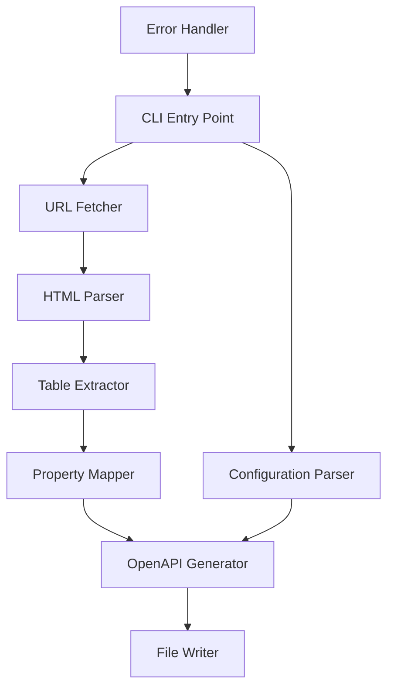

# Design Document

## Overview

ApiWeaver is a Java command-line application that extracts API object definitions from TimeTap's HTML documentation and generates OpenAPI 3.1.1 specification files. The tool uses HTML parsing to locate specific table structures and converts property information into structured OpenAPI schemas.

## Architecture

The application follows a modular architecture with clear separation of concerns:



### Core Components

1. **CLI Entry Point**: Handles command-line arguments and orchestrates the workflow
2. **URL Fetcher**: Retrieves HTML content from provided URLs
3. **HTML Parser**: Parses HTML using JSoup library
4. **Table Extractor**: Locates and extracts data from target tables
5. **Property Mapper**: Maps HTML property types to OpenAPI data types
6. **OpenAPI Generator**: Creates or amends OpenAPI 3.1.1 specifications
7. **File Writer**: Handles output file operations
8. **Error Handler**: Provides consistent error handling and logging

## Components and Interfaces

### CLI Entry Point

```java
public class ApiWeaverCli {
    public static void main(String[] args)
    private void parseArguments(String[] args)
    private void displayHelp()
    private void validateConfiguration()
}
```

### URL Fetcher

```java
public interface UrlFetcher {
    String fetchHtmlContent(String url) throws FetchException;
}

public class HttpUrlFetcher implements UrlFetcher {
    private final int timeoutMs;
    private final String userAgent;
}
```

### HTML Parser

```java
public interface HtmlParser {
    Document parseHtml(String htmlContent);
    List<Element> findH2ElementsWithIdEndingIn(Document doc, String suffix);
    Element findFirstTableAfterElement(Document doc, Element element);
}

public class JSoupHtmlParser implements HtmlParser {
    // Implementation using JSoup library
}
```

### Table Extractor

```java
public interface TableExtractor {
    List<PropertyDefinition> extractProperties(Element table) throws ExtractionException;
}

public class PropertyTableExtractor implements TableExtractor {
    private Map<String, Integer> identifyColumns(Element table);
    private PropertyDefinition parseRow(Element row, Map<String, Integer> columnMap);
    private String extractDescription(Element row, int descriptionColumnIndex);
}
```

### Property Mapper

```java
public interface PropertyMapper {
    OpenApiProperty mapToOpenApiProperty(PropertyDefinition property);
    String mapHtmlTypeToOpenApiType(String htmlType);
}

public class TimeTapPropertyMapper implements PropertyMapper {
    private static final Map<String, String> TYPE_MAPPINGS;
}
```

### OpenAPI Generator

```java
public interface OpenApiGenerator {
    OpenApiSpec generateOrAmendSpec(List<OpenApiProperty> properties, OpenApiSpec existing);
    OpenApiSpec createNewSpec();
    OpenApiSpec loadExistingSpec(String filePath) throws IOException;
}

public class OpenApi31Generator implements OpenApiGenerator {
    private final ObjectMapper yamlMapper;
}
```

## Data Models

### PropertyDefinition

```java
public class PropertyDefinition {
    private final String name;
    private final String type;
    private final boolean required;
    private final boolean writable;
    private final String description;
    
    // Constructor, getters, validation methods
}
```

### OpenApiProperty

```java
public class OpenApiProperty {
    private final String name;
    private final String type;
    private final String format;
    private final boolean required;
    private final boolean readOnly;
    private final String description;
    
    // Constructor, getters, builder pattern
}
```

### OpenApiSpec

```java
public class OpenApiSpec {
    private String openapi = "3.1.1";
    private Info info;
    private Map<String, Schema> components;
    
    // Methods for adding/updating schemas
}
```

### Configuration

```java
public class Configuration {
    private final String url;
    private final String outputFile;
    private final String existingSpecFile;
    private final boolean verbose;
    private final int timeoutMs;
    
    // Builder pattern for configuration
}
```

## Error Handling

### Exception Hierarchy

```java
public class ApiWeaverException extends Exception {
    // Base exception class
}

public class FetchException extends ApiWeaverException {
    // URL fetching errors
}

public class ParseException extends ApiWeaverException {
    // HTML parsing errors
}

public class ExtractionException extends ApiWeaverException {
    // Table extraction errors
}

public class GenerationException extends ApiWeaverException {
    // OpenAPI generation errors
}
```

### Error Handling Strategy

- All exceptions include contextual information (URL, line numbers, etc.)
- User-friendly error messages for common scenarios
- Detailed logging for debugging purposes
- Graceful degradation where possible (skip malformed rows, continue processing)
- Appropriate exit codes for different error types

## Testing Strategy

### Unit Testing

- **URL Fetcher**: Mock HTTP responses, test timeout handling, error scenarios
- **HTML Parser**: Test with various HTML structures, malformed HTML
- **Table Extractor**: Test column identification, row parsing, edge cases
- **Property Mapper**: Test type mappings, validation logic
- **OpenAPI Generator**: Test schema generation, merging logic

### Integration Testing

- **End-to-End**: Test complete workflow with sample HTML files
- **File Operations**: Test reading/writing OpenAPI files
- **Error Scenarios**: Test error propagation and handling

### Test Data

- Sample HTML files representing different TimeTap documentation formats
- Expected OpenAPI output files for validation
- Edge case HTML structures (missing columns, malformed tables)

## Dependencies

### Core Libraries

- **JSoup**: HTML parsing and DOM manipulation
- **Jackson**: YAML/JSON processing for OpenAPI files
- **Apache Commons CLI**: Command-line argument parsing
- **SLF4J + Logback**: Logging framework

### Build Tool

- **Maven**: Dependency management and build lifecycle
- **Maven Shade Plugin**: Create executable JAR with dependencies

### Testing Libraries

- **JUnit 5**: Unit testing framework
- **Mockito**: Mocking framework for unit tests
- **AssertJ**: Fluent assertions for better test readability

## Configuration and Deployment

### Command-Line Interface

```bash
java -jar apiweaver.jar [OPTIONS] <URL>

Options:
  -o, --output <file>     Output OpenAPI file path (default: generated-api.yaml)
  -e, --existing <file>   Existing OpenAPI file to amend
  -v, --verbose          Enable verbose output
  -t, --timeout <ms>     HTTP timeout in milliseconds (default: 30000)
  -h, --help             Display help information
```

### Build Configuration

- Maven POM with appropriate plugin configurations
- Executable JAR generation with all dependencies
- Version management and release profiles

## Performance Considerations

### Memory Usage

- Stream-based processing where possible
- Avoid loading entire HTML DOM into memory for large documents
- Efficient string processing for type mappings

### Network Operations

- Configurable timeouts for HTTP requests
- User-agent string to identify the tool
- Retry logic for transient network failures

### File I/O

- Atomic file operations to prevent corruption
- Backup existing files before modification
- Efficient YAML parsing and generation
